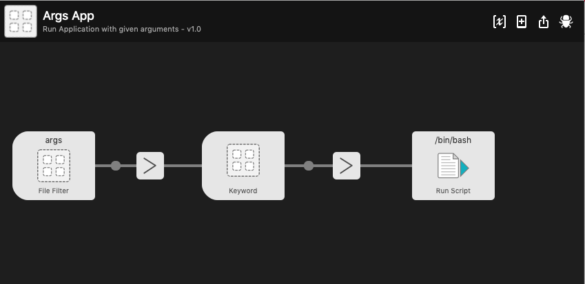

# alfred-args-app
Alfred's workflow for running Applications with arguments<br />
https://www.alfredapp.com/

Some applications can be executed with additional parameters, so this workflow allows this.<br />
First we are asked to select Application, then arguments which should be used.

Workflow executes application in a following way:
```bash
open <APPLICAITON> --args <ARGUMENTS>
```

# Usage:

**args \<APPLICATION\>**  (Type *args* and then select application)


**\<ARGUMENTS\>** (then type arguments which should be used)


# Workflow diagram:


